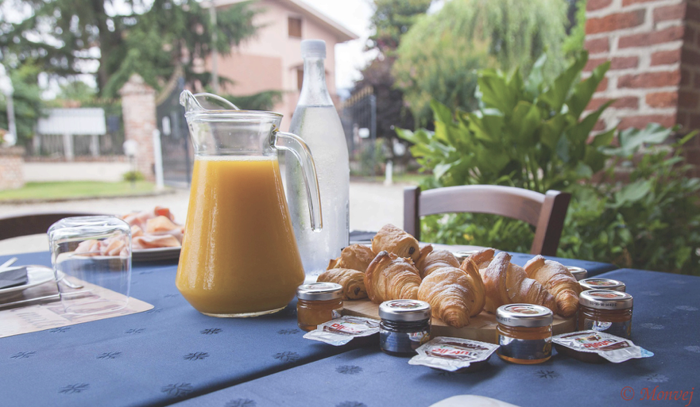

<h3> The Harvard Chan Bioinformatics Core (HBC) presents  </h3>

 <h1> Monthly Bioinformatics Community Breakfasts </h1> 

 <h3> <b> Come join us! </b> </h3> 

The [Harvard Chan Bioinformatics Core](http://bioinformatics.sph.harvard.edu/) **invites you for breakfast** on the **last Wednesday of every month** between **9:00 & 10:30**!

### These breakfasts will provide you with an opportunity to:

* Learn about bioinformatics training opportunities and community resources available
* Discuss bioinformatics-related questions
* Help foster a local bioinformatics community
* Get to know the HBC analysts and trainers, in addition to members from other facilities associated with bioinformatics research (in one way or another), including:
  * [Single Cell Core](https://singlecellcore.hms.harvard.edu/)
  * [HMS Research Computing](https://rc.hms.harvard.edu/)
  * [BCH Research Computing](https://www.researchcomputing.org/)
 
### Dates and Locations: 

| Date |  Location |
| :----: | :----: |
| September 25th | [HMS’ Jeffrey Modell Center for Immunology, Room 100A](https://goo.gl/maps/23ck7uK8LggeecGY6) |
| October 30th | [HMS’ Jeffrey Modell Center for Immunology, Room 100A](https://goo.gl/maps/23ck7uK8LggeecGY6) |
| November 20th | [HMS’ Jeffrey Modell Center for Immunology, Room 100A](https://goo.gl/maps/23ck7uK8LggeecGY6) |
| December 18th | [HMS’ Jeffrey Modell Center for Immunology, Room 100A](https://goo.gl/maps/23ck7uK8LggeecGY6) |

>_**Detailed directions to the Jeffrey Modell Center for Immunology:** From the HMS quad, go to the building entrance of the Courtyard cafe, then turn left at the security guard. At the end of the hall is the Modell Center._

There is no registration for attending these, but seating and food will be available on a first-come-first-served basis. This is a time to get together without computers and we welcome anyone with bioinformatics questions or just an interest in bioinformatics, in addition to other bioinformaticians looking for a community. You don’t have to stay for the entire breakfast, but we plan to have introductions at 9:30am. 

**We hope to see you there!**
 
